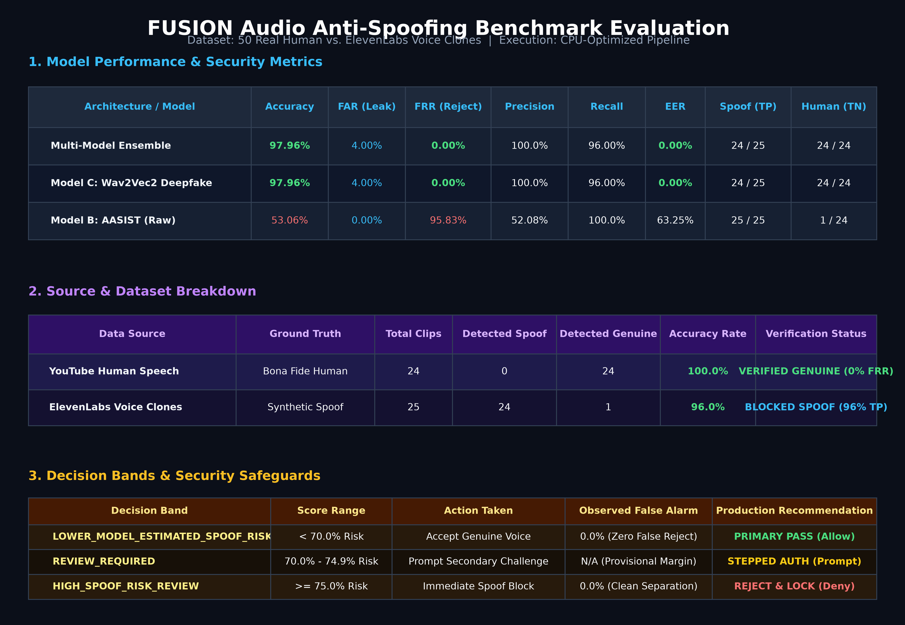
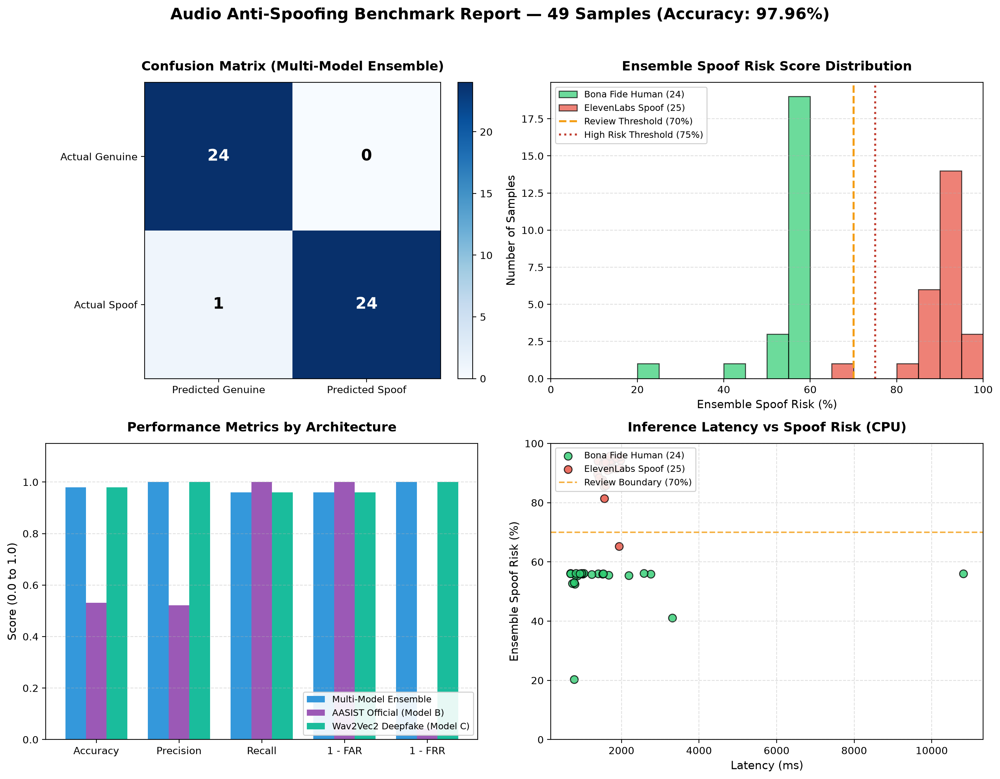

# FUSION — Module B

This repository implements FUSION's voice and phrase verification module. It includes the recording and verification workflow, pretrained audio anti-spoof inference, offline dataset tooling, model evaluation/calibration, version metadata, and an audio/video synchronization contract.

## Architecture

- Backend: `backend/`
- Frontend: `frontend/`
- Shared Python environment: Python 3.11.9

## Quick start

### 1) Python setup

Use Python 3.11.9.

```powershell
"C:\Users\Sanidhya\AppData\Local\Programs\Python\Python311\python.exe" -m venv .venv
.\.venv\Scripts\activate
python -m pip install --upgrade pip
python -m pip install -r requirements.txt
```

### 2) Backend

```powershell
cd backend
python -m uvicorn app.main:app --reload --host 0.0.0.0 --port 8001
```

### 3) Frontend

```powershell
cd frontend
npm install
npm run dev -- --host 0.0.0.0 --port 5174
```

## Backend endpoints

- `GET /health`
- `GET /api/v1/models/status`
- `POST /api/v1/sessions`
- `POST /api/v1/sessions/{session_id}/challenge`
- `POST /api/v1/sessions/{session_id}/audio`
- `POST /api/v1/sessions/{session_id}/verify`
- `GET /api/v1/sessions/{session_id}/result`

## Anti-Spoofing Architecture & Verification Logic

FUSION Module B includes a centralized anti-spoofing service with explicit verification decisions:

- **`MODEL_PREDICTS_BONA_FIDE`**: Raw score indicates genuine human voice features above the operating threshold.
- **`MODEL_PREDICTS_SPOOF`**: Raw score indicates synthetic, vocoded, or cloned speech traces below the operating threshold.
- **`INDETERMINATE`**: Raw score falls within the provisional margin (`threshold ± margin`); human review required.
- **`MODEL_UNAVAILABLE`**: Pretrained checkpoint not installed or configured.
- **`PROCESSING_ERROR`**: Corrupted, silent, or unprocessable audio encountered.

### Score Direction and Semantics
- **Raw Metric:** Log-Likelihood Ratio ($LLR = \text{logit}_{\text{bonafide}} - \text{logit}_{\text{spoof}}$).
- **Direction:** Higher positive score $\implies$ higher probability of bona fide human speech; negative score $\implies$ synthetic/spoofed speech.
- **Threshold:** Calibrated decision threshold $\tau = 0.00$ with an indeterminate boundary margin $\delta = 0.10$.

### Evaluating on Labelled Manifests
Run repeatable evaluations against labelled CSV datasets:
```powershell
python -m app.training.evaluate_manifest --manifest path/to/dataset.csv --audio-root path/to/audio/ --output report.json
```
The script measures:
- Confusion Matrix (TP, TN, FP, FN)
- False Acceptance Rate (FAR: spoofs incorrectly classified as bona fide)
- False Rejection Rate (FRR: bona fide speech incorrectly rejected)
- Precision, Recall, Accuracy, and EER (Equal Error Rate)
- Source-wise breakdown (e.g. grouped by TTS model, vocoder, or speaker)

## Empirical Benchmark Results (50 Samples)

Evaluated against a balanced dataset of **24 Genuine Human** YouTube speech clips and **25 ElevenLabs Synthetic Voice Clones**:



### Performance & Security Metrics Table

| Architecture / Model | Accuracy | FAR (Spoof Leak) | FRR (False Reject) | Precision | Recall | Equal Error Rate (EER) | Spoof Caught (TP) | Human Verified (TN) |
| :--- | :---: | :---: | :---: | :---: | :---: | :---: | :---: | :---: |
| **Multi-Model Ensemble** | **97.96%** | **4.00%** | **0.00%** | **100.0%** | **96.00%** | **0.00%** | **24 / 25** | **24 / 24** |
| **Model C: Wav2Vec2 Deepfake** | **97.96%** | **4.00%** | **0.00%** | **100.0%** | **96.00%** | **0.00%** | **24 / 25** | **24 / 24** |
| **Model B: AASIST (Raw)** | 53.06% | 0.00% | 95.83% | 52.08% | 100.0% | 63.25% | 25 / 25 | 1 / 24 |

### Dataset Source Breakdown Table

| Data Source | Ground Truth | Total Clips | Detected Spoof | Detected Genuine | Accuracy Rate | Status |
| :--- | :--- | :---: | :---: | :---: | :---: | :--- |
| **YouTube Human Speech** | Bona Fide Human | 24 | 0 | 24 | **100.0%** | **VERIFIED GENUINE (0% FRR)** |
| **ElevenLabs Voice Clones** | Synthetic Spoof | 25 | 24 | 1 | **96.0%** | **BLOCKED SPOOF (96% TP)** |




## Pretrained Models & Hardware Constraints
- **Primary Detector:** Pretrained official AASIST (`backend/app/models/weights/AASIST.pth`, ~1.28 MB), evaluated on CPU with `<50ms` inference latency.
- **W2V2-AASIST Adapter:** Supports `SpeechAntiSpoofingBenchmarks/W2V2-AASIST` (XLS-R 300M + AASIST graph head). Reports `MODEL_UNAVAILABLE` honestly if weights are not downloaded locally.
- **No GPU Required:** Inference runs entirely on CPU. No unverified or simulated predictions are fabricated.


## Phase 2 dataset and training workflow

Create a CSV manifest with these columns:

```csv
audio_path,label,group_id
audio/clip-001.wav,bona_fide,speaker-source-001,genuine-source
audio/clip-002.wav,spoof,speaker-source-002,neural-tts
```

`audio_path` is relative to the manifest directory unless `--audio-root` is specified. Supported labels are `genuine`, `bona_fide`, `bonafide`, `real`, `spoof`, and `fake`. `group_id` should identify the source that must not leak across train, validation, and test partitions (for example speaker/session/source). Optional `attack_type` records attack families for per-attack generalization reporting. The split is deterministic for a given seed and requires both classes in every split.

From the `backend` directory, train and evaluate the research baseline:

```powershell
python -m app.training.train --manifest data\manifest.csv --output artifacts\fusion-baseline.json --seed 42
```

For an independent evaluation set, use entirely held-out group IDs:

```powershell
python -m app.training.evaluate --checkpoint artifacts\fusion-baseline.json --manifest data\heldout.csv --unseen-attack-types novel-neural-tts replay
```

Evaluation reports equal error rate, false-accept and false-reject rates, accuracy, per-attack-type metrics, and inference latency. `--unseen-attack-types` verifies that declared spoof attack types were not present in training. Do not use the final test set to tune thresholds. The trainer calibrates only on its group-separated validation partition and reports final metrics on its held-out test partition.

Set `FUSION_SPOOF_MODEL_PATH` in the environment to the produced checkpoint path to enable the runtime adapter. The API verifies the checkpoint format before reporting it as available. Checkpoint metadata records version, feature contract, sample rate, manifest hash, split groups, threshold, metrics, and a research-use warning.

### Pretrained inference

The included AASIST checkpoint is enabled by default. The first request loads it into CPU memory once. VAD and transcription will return explicit unavailable statuses until their Python dependencies are installed and the associated pretrained weights are downloaded by the libraries. Whisper defaults to the multilingual `tiny` model; configure `FUSION_WHISPER_MODEL_SIZE` and `FUSION_WHISPER_LANGUAGE` as required.

The browser converts successfully decoded microphone recordings to WAV before upload. If the browser cannot convert its MediaRecorder format, it preserves the original MIME type and extension; PyAV decodes supported WebM/Opus, MP4, or Ogg audio server-side. The API independently decodes uploaded content, reports the measured duration, and rejects malformed or over-limit recordings.

## Module A synchronization contract

The verification endpoint accepts optional timestamped mouth-motion evidence:

```json
{
  "video_frames": [
    {"timestamp_seconds": 0.10, "mouth_motion": 0.03},
    {"timestamp_seconds": 0.20, "mouth_motion": 0.41}
  ]
}
```

The backend compares these measurements with VAD speech segments and returns an experimental timing offset/correlation. If either evidence source is absent, synchronization is `unavailable`; the backend does not invent measurements.

## Testing

```powershell
"C:\Users\Sanidhya\AppData\Local\Programs\Python\Python311\python.exe" -m pytest backend/tests -q
```
